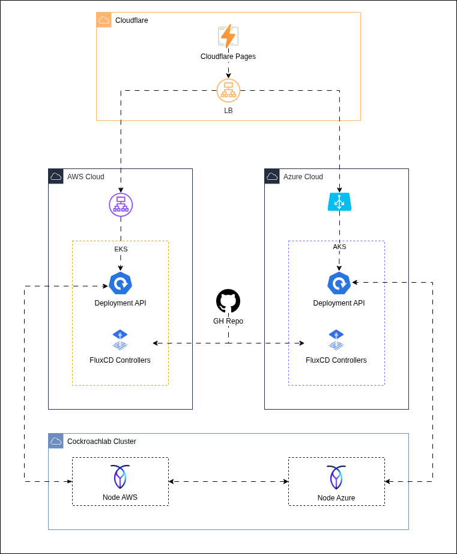

<h1 align="center">
  GS01 - Arquitetura Multicloud
</h1>

<p align="center">
  
</p>

<p align="center">
  <a href="https://skillicons.dev">
    
  </a>
</p>

## Qual a finalidade do projeto?

Global Solution da disciplina de Advanced Cloud Engineering (multicloud). O projeto demonstra uma aplicacao web distribuida em uma arquitetura **multicloud**, com backend executando simultaneamente em **AWS EKS** e **Azure AKS**, frontend publicado no **Cloudflare Pages**, roteamento de API via **Cloudflare Load Balancer** e persistencia em **CockroachDB**.

A proposta e validar uma entrega resiliente e portavel: a mesma imagem da API roda em dois provedores de nuvem, os manifests Kubernetes sao sincronizados com **FluxCD**, os segredos sao protegidos com **SOPS + age**, e a borda da aplicacao fica centralizada na Cloudflare.

O frontend consome a API por uma URL unica. A Cloudflare distribui as requisicoes entre os load balancers dos clusters na AWS e na Azure. Cada resposta da API informa a nuvem que atendeu a chamada por meio da variavel `CLOUD_NAME`, permitindo visualizar a alternancia entre os provedores.


## O que foi construído

### Aplicacao

| Camada | Descricao |
|---|---|
| Frontend | Aplicacao React + Vite + TypeScript publicada no Cloudflare Pages |
| Backend | API REST Node.js + Express containerizada com Docker |
| Banco de dados | CockroachDB Serverless acessado via protocolo PostgreSQL |
| Identificacao da nuvem | Campo `cloud` retornado pela API em cada requisicao |

### Infraestrutura

| Area | Descricao |
|---|---|
| AWS | Cluster EKS provisionado com Terraform |
| Azure | Cluster AKS provisionado com Terraform |
| Kubernetes | Manifests base e overlays por nuvem usando Kustomize |
| GitOps | FluxCD instalado nos clusters para sincronizar os manifests do repositorio |
| Segredos | Secret do banco criptografado no Git com SOPS + age |
| Cloudflare | Pages, DNS e Load Balancer para expor frontend e API |

### API

| Metodo | Endpoint | Finalidade |
|---|---|---|
| `GET` | `/health` | Verifica saude da API |
| `GET` | `/api/subjects` | Lista materias |
| `POST` | `/api/subjects` | Cria uma nova materia |
| `PATCH` | `/api/subjects/:id` | Alterna status de conclusao |
| `DELETE` | `/api/subjects/:id` | Remove uma materia |

## Tecnologias utilizadas

- **AWS EKS:** execucao da API em Kubernetes na AWS;
- **Azure AKS:** execucao da mesma API em Kubernetes na Azure;
- **Cloudflare Pages:** hospedagem do frontend React;
- **Cloudflare DNS e Load Balancer:** entrada unica para a API multicloud;
- **Terraform:** provisionamento da infraestrutura como codigo;
- **FluxCD:** sincronizacao GitOps dos manifests Kubernetes;
- **SOPS + age:** criptografia de secrets versionados;
- **Docker + GHCR:** empacotamento e publicacao da imagem da API;
- **Node.js + Express:** backend REST;
- **React + Vite + TypeScript:** frontend web;
- **CockroachDB Serverless:** banco relacional externo compartilhado entre os clusters.


## Estrutura do repositório

```text
gs01-multicloud.fiap/
├── app/                         # Aplicacao: frontend React e backend Node.js
├── docs/                        # Materiais visuais e apoio da arquitetura
├── fluxcd/                      # GitOps: manifests Kubernetes e overlays por nuvem
├── terraform/                   # Infraestrutura como codigo
│   ├── aws/                     # Cluster EKS e FluxCD na AWS
│   ├── azure/                   # Cluster AKS e FluxCD na Azure
│   └── cloudflare/              # Pages, DNS e Load Balancer
└── README.md                    # Visao macro do projeto
```

## Fluxo de funcionamento

1. O codigo da aplicacao e versionado no GitHub.
2. A imagem Docker da API e publicada no GitHub Container Registry.
3. Terraform cria os clusters EKS e AKS e instala o FluxCD.
4. FluxCD sincroniza os manifests do diretorio `fluxcd/`.
5. Cada cluster sobe a mesma API com `CLOUD_NAME` diferente.
6. Cloudflare aponta a URL da API para os load balancers da AWS e da Azure.
7. Cloudflare Pages publica o frontend e consome a API pela URL unica.
8. CockroachDB centraliza os dados acessados pelas duas instancias da API.

## Como validar a entrega

Em uma validacao end-to-end, o frontend deve listar, criar, concluir e remover materias pela API. Ao atualizar ou repetir chamadas, o indicador de nuvem pode alternar entre **AWS** e **Azure**, confirmando que a entrada da Cloudflare esta distribuindo trafego entre os dois clusters.

Pontos principais de validacao:

- frontend publicado no Cloudflare Pages;
- endpoint `/health` respondendo pela URL publica da API;
- API retornando o campo `cloud`;
- servicos Kubernetes expostos nos dois clusters;
- dados persistidos no CockroachDB;
- manifests sincronizados via FluxCD;
- secrets sensiveis mantidos criptografados no repositorio.